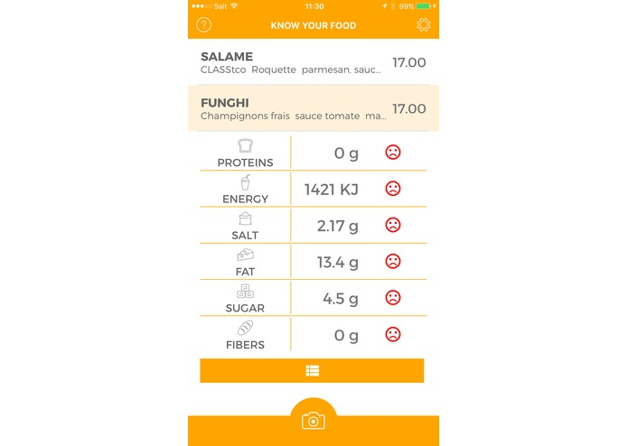

# Know your food

Project at [Lauzhack](http://lauzhack.com) 2016 (finals).

## Why ?

Nowaday, people want to be more and more aware about their health because of restrictive diets and allergies. Wearables, trackers, big data recommender systems are all emerging technologies which try their best at solving these demands.

## What ?

At "Know your food", we offer an easy way to extract from any image nutritional information and related facts. As an example, you can get insights about the dietary contents of a restaurant menu using a picture of it. You can then explore each meal's contribution to your daily needs and chose accordingly.

## How ?

Based on [openFood](https://www.openfood.ch/) nutritional dataset, and state-of-the-art OCR, we built a natural language processing pipeline to get instant matching between a photo and ingredients facts.


*Restaurant menu example.*


*App response.*

## Getting started

```shell
docker run -p 56792:9000 --name fs -d minio/minio server /export
docker run -d --name kyf -p "53837:9200" elasticsearch
```

0. update all server addresses and api keys
1. run data cleaning (`research`) over extracted csv from [OpenFood](https://www.openfood.ch)
2. create elasticsearch index
2. insert it in elasticsearch through jupyter notebook
3. run the server (`cd server && grunt dev`)
4. launch the react native app (`cd app && react-native run-[ios|android]`)
